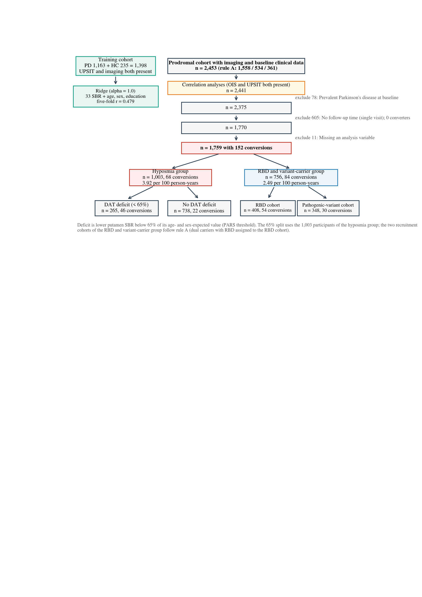
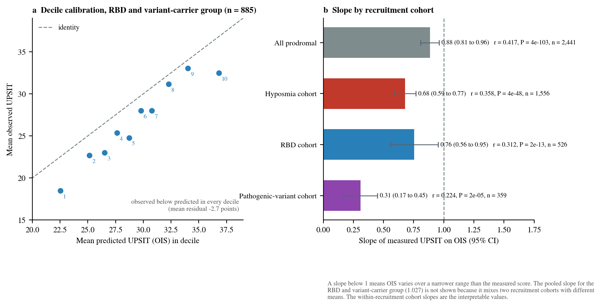
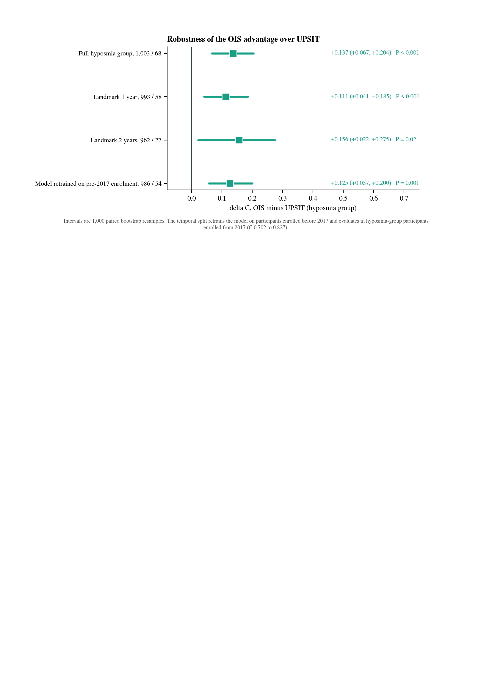
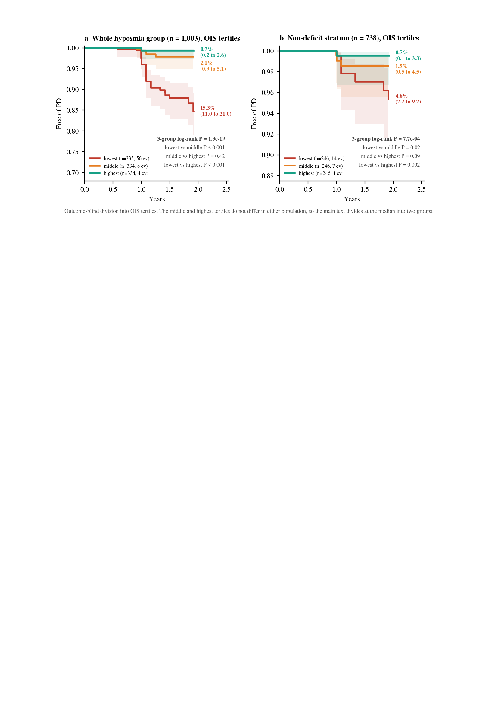
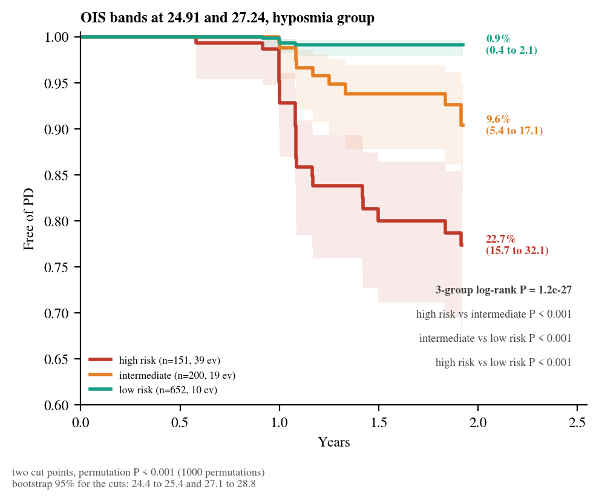

# Supplementary Information

**Decomposition of the olfactory score by dopamine transporter imaging improves Parkinson's disease risk stratification in hyposmic individuals**

## Contents

- Supplementary Methods 1–2
- Supplementary Tables 1–11
- Supplementary Figures 1–5

## Supplementary Methods

**Supplementary Method 1. Assignment to recruitment cohort.** PPMI enrols prodromal participants through three recruitment cohorts, namely olfactory screening (the hyposmia cohort), polysomnography-confirmed REM sleep behaviour disorder (RBD) and pathogenic-variant carriage. Six individuals carry a pathogenic variant and also have RBD. Rule A, used throughout the main text, assigns them to the RBD cohort (1,558 / 534 / 361). Rule B assigns them to the pathogenic-variant cohort (1,558 / 528 / 367). Both rules total 2,453 and the held-out correlations differ only in the third decimal (Supplementary Table 1).

**Supplementary Method 2. Imaging-state determination and its validation.** DAT deficit is defined on the PPMI canonical quantity, the lower of the two putamen binding ratios divided by the value expected from a linear regression on age and sex fitted in healthy controls (n = 239), expected = 1.8547 − 0.00303 × age − 0.2419 × sex. Official staging fields are populated only for the Parkinson's disease and SWEDD cohorts in the curated cut, so the implementation was validated there. At the 0.75 cut used by the staging system it reproduced the official determination in 99.7% of 1,181 participants, with all 4 disagreements inside the band 0.7315 to 0.7486. The 65% cut used for the deficit split comes from PARS.

## Supplementary Tables

### Supplementary Table 1. Model families, training-set choice and held-out correlation by recruitment cohort

**a. Six regression families, five-fold cross-validation in the training cohort (n = 1,398), identical folds (seed 41).**

| Family | Pooled Pearson r | Fold mean ± s.d. | Fold range | Spearman ρ | MAE (points) |
|---|---|---|---|---|---|
| Ridge | 0.479 | 0.485 ± 0.056 | 0.412 to 0.553 | 0.450 | 6.23 |
| RF | 0.471 | 0.476 ± 0.057 | 0.405 to 0.548 | 0.404 | 6.20 |
| SVR-Lin | 0.473 | 0.479 ± 0.057 | 0.397 to 0.544 | 0.442 | 6.24 |
| XGBoost | 0.478 | 0.481 ± 0.054 | 0.420 to 0.553 | 0.430 | 6.15 |
| LightGBM | 0.470 | 0.475 ± 0.055 | 0.412 to 0.543 | 0.420 | 6.19 |
| GradBoost | 0.474 | 0.478 ± 0.051 | 0.418 to 0.545 | 0.418 | 6.16 |

Ridge was retained because the families are indistinguishable and a linear model keeps the fitted value interpretable as a weighted sum of binding ratios.

**b. Choice of training set.**

| Training set | n | CV r (UPSIT) | C-index for conversion, hyposmia group |
|---|---|---|---|
| PD + HC (main) | 1,398 | 0.479 | 0.835 |
| HC only | 235 | 0.280 | 0.544 |
| PD only | 1,163 | 0.279 | 0.835 |

Training on healthy controls alone gives an OIS with no discrimination. Down-sampling the Parkinson's disease group to the same n = 235 and repeating 200 times gives C = 0.806 ± 0.020 (0 of 200 below 0.55), so the failure is range restriction rather than sample size, since 18.1% of hyposmia-group participants fall outside the imaging range of healthy controls. The PD-only model correlates r = 0.994 with the main model.

**c. Held-out correlation between OIS and measured UPSIT in the prodromal cohort, by recruitment cohort.**

| Recruitment cohort | n | r | P | UPSIT mean (s.d.) |
|---|---|---|---|---|
| Hyposmia | 1,556 | 0.358 | 3.5 × 10−48 | 21.2 (6.9) |
| RBD | 526 | 0.312 | 2.4 × 10−13 | 22.4 (8.3) |
| Variant carriers | 359 | 0.224 | 1.9 × 10−5 | 33.0 (5.4) |

Pooled r = 0.417 (n = 2,441).

**d. Leave-one-centre-out correlation at each of the 44 centres, with the patient and control counts that centre contributed.**

| No. | Centre | n | Patients | Controls | Controls, % of centre | r | P | UPSIT s.d. |
|---|---|---|---|---|---|---|---|---|
| 1 | site_39 | 13 | 12 | 1 | 8% | −0.169 | 0.58 | 7.12 |
| 2 | site_70 | 28 | 28 | 0 | 0% | −0.094 | 0.63 | 7.29 |
| 3 | site_75 | 10 | 10 | 0 | 0% | 0.058 | 0.87 | 3.99 |
| 4 | site_32 | 20 | 20 | 0 | 0% | 0.100 | 0.68 | 8.51 |
| 5 | site_15 | 12 | 12 | 0 | 0% | 0.133 | 0.68 | 6.81 |
| 6 | site_44 | 14 | 13 | 1 | 7% | 0.170 | 0.56 | 8.65 |
| 7 | site_23 | 29 | 27 | 2 | 7% | 0.194 | 0.31 | 7.64 |
| 8 | site_36 | 29 | 27 | 2 | 7% | 0.231 | 0.23 | 8.90 |
| 9 | site_74 | 16 | 16 | 0 | 0% | 0.235 | 0.38 | 6.39 |
| 10 | site_79 | 19 | 9 | 10 | 53% | 0.272 | 0.26 | 7.55 |
| 11 | site_69 | 12 | 12 | 0 | 0% | 0.277 | 0.38 | 6.07 |
| 12 | site_71 | 40 | 40 | 0 | 0% | 0.284 | 0.08 | 7.45 |
| 13 | site_67 | 47 | 47 | 0 | 0% | 0.341 | 0.02 | 6.71 |
| 14 | site_42 | 40 | 33 | 7 | 18% | 0.367 | 0.02 | 9.62 |
| 15 | site_37 | 41 | 36 | 5 | 12% | 0.379 | 0.01 | 9.18 |
| 16 | site_33 | 60 | 50 | 10 | 17% | 0.395 | 0.002 | 10.09 |
| 17 | site_72 | 42 | 38 | 4 | 10% | 0.432 | 0.004 | 8.26 |
| 18 | site_28 | 34 | 23 | 11 | 32% | 0.449 | 0.008 | 9.47 |
| 19 | site_61 | 56 | 50 | 6 | 11% | 0.462 | 3.4 × 10−4 | 7.00 |
| 20 | site_24 | 48 | 41 | 7 | 15% | 0.465 | 8.6 × 10−4 | 9.23 |
| 21 | site_26 | 125 | 104 | 21 | 17% | 0.473 | 2.5 × 10−8 | 8.66 |
| 22 | site_12 | 13 | 11 | 2 | 15% | 0.475 | 0.10 | 10.49 |
| 23 | site_34 | 21 | 18 | 3 | 14% | 0.487 | 0.03 | 7.76 |
| 24 | site_38 | 28 | 22 | 6 | 21% | 0.503 | 0.006 | 9.33 |
| 25 | site_66 | 15 | 15 | 0 | 0% | 0.508 | 0.05 | 5.86 |
| 26 | site_17 | 19 | 17 | 2 | 11% | 0.515 | 0.02 | 7.69 |
| 27 | site_62 | 46 | 37 | 9 | 20% | 0.515 | 2.5 × 10−4 | 7.72 |
| 28 | site_29 | 22 | 15 | 7 | 32% | 0.527 | 0.01 | 7.89 |
| 29 | site_31 | 66 | 57 | 9 | 14% | 0.555 | 1.3 × 10−6 | 9.11 |
| 30 | site_73 | 19 | 13 | 6 | 32% | 0.558 | 0.01 | 7.16 |
| 31 | site_21 | 28 | 23 | 5 | 18% | 0.562 | 0.002 | 8.18 |
| 32 | site_35 | 50 | 33 | 17 | 34% | 0.589 | 6.7 × 10−6 | 9.20 |
| 33 | site_19 | 71 | 59 | 12 | 17% | 0.593 | 5.1 × 10−8 | 8.54 |
| 34 | site_27 | 14 | 12 | 2 | 14% | 0.605 | 0.02 | 8.84 |
| 35 | site_13 | 33 | 19 | 14 | 42% | 0.621 | 1.1 × 10−4 | 9.15 |
| 36 | site_10 | 25 | 16 | 9 | 36% | 0.622 | 9.0 × 10−4 | 9.67 |
| 37 | site_25 | 23 | 18 | 5 | 22% | 0.634 | 0.001 | 10.25 |
| 38 | site_14 | 28 | 23 | 5 | 18% | 0.648 | 1.9 × 10−4 | 8.79 |
| 39 | site_18 | 21 | 18 | 3 | 14% | 0.659 | 0.001 | 6.44 |
| 40 | site_41 | 18 | 17 | 1 | 6% | 0.675 | 0.002 | 9.28 |
| 41 | site_22 | 29 | 20 | 9 | 31% | 0.684 | 4.3 × 10−5 | 10.39 |
| 42 | site_64 | 12 | 9 | 3 | 25% | 0.689 | 0.01 | 7.13 |
| 43 | site_63 | 20 | 7 | 13 | 65% | 0.706 | 5.1 × 10−4 | 5.08 |
| 44 | site_20 | 16 | 14 | 2 | 12% | 0.709 | 0.002 | 7.82 |

The 44 centres are numbered 1 to 44 in order of r, and the centre column gives the PPMI site code. Across the 44 centres the correlation rises with the control fraction (r = 0.521, P = 2.8 × 10−4) and is unrelated to centre size (r = 0.140, P = 0.36). Median centre size 26. The 35 centres that enrolled controls as well as patients reach a mean r of 0.493 against 0.204 in the 9 that enrolled patients only (Welch P = 8.4 × 10−4), and the two negative centres are both patient-dominated, so UPSIT and the scan each vary over a narrow range there and a within-centre correlation carries little information. 30 of 44 reach P < 0.05, against 26.5 expected under a true correlation of 0.434 at the observed centre sizes.

### Supplementary Table 2. Follow-up by recruitment cohort and group

| Group | n | Conversions | Median first-visit year | Median follow-up (y) | Followed ≥ 4 y | Person-years | Per 100 person-years | 2-year KM conversion |
|---|---|---|---|---|---|---|---|---|
| Hyposmia cohort | 1,003 | 68 | 2023 | 1.34 | 1.7% | 1,734 | 3.92 | 5.8% |
| RBD cohort | 408 | 54 | 2023 | 2.00 | 5.6% | 856 | 6.31 | 9.7% |
| Pathogenic-variant cohort | 348 | 30 | 2017 | 8.00 | 89.4% | 2,516 | 1.19 | 2.3% |
| RBD and variant-carrier group (RBD + carriers) | 756 | 84 | 2022 | 3.00 | 44.2% | 3,372 | 2.49 | 5.8% |
| All prodromal | 1,759 | 152 | 2023 | 2.00 | 20.0% | 5,106 | 2.98 | 5.9% |

Survival cohort after the exclusions in Methods (1,759 / 152). The RBD and variant-carrier group accrues more conversions than the hyposmia group (84 against 68) because it is followed longer, not because it is at higher risk. Per 100 person-years the hyposmia group is 3.92 against 2.49, and the two-year Kaplan–Meier estimates coincide. Within the hyposmia group cumulative conversion by Kaplan–Meier is 1.0% at 1 y (817 at risk), 5.8% at 2 y (432 at risk), 10.7% at 3 y (103 at risk), 24.9% at 4 y (17 at risk). The four-year value rests on 17 participants and is not used.

### Supplementary Table 3. Discrimination of every reading, continuous against dichotomised, by stratum, and head to head with OIS

**a. Continuous against dichotomised readings.**

| Stratum | Reading | Participants / conversions | C-index (95% CI) |
|---|---|---|---|
| All prodromal | UPSIT, continuous | 1,759 / 152 | 0.700 (0.653–0.745) |
| All prodromal | UPSIT, dichotomised at the 15th percentile | 1,759 / 152 | 0.618 (0.581–0.655) |
| All prodromal | Imaging, continuous (lower putamen, % expected) | 1,759 / 152 | 0.750 (0.702–0.798) |
| All prodromal | Imaging, dichotomised (DAT-deficit flag, 65%) | 1,759 / 152 | 0.716 (0.675–0.761) |
| All prodromal | OIS, continuous | 1,759 / 152 | 0.799 (0.754–0.842) |
| Hyposmia group | UPSIT, continuous | 1,003 / 68 | 0.698 (0.633–0.760) |
| Hyposmia group | UPSIT, dichotomised at the 15th percentile | 1,003 / 68 | 0.580 (0.547–0.607) |
| Hyposmia group | Imaging, continuous (lower putamen, % expected) | 1,003 / 68 | 0.761 (0.675–0.843) |
| Hyposmia group | Imaging, dichotomised (DAT-deficit flag, 65%) | 1,003 / 68 | 0.749 (0.683–0.806) |
| Hyposmia group | OIS, continuous | 1,003 / 68 | 0.835 (0.770–0.892) |

Dichotomisation costs 0.082 of concordance for UPSIT and 0.035 for imaging in the whole prodromal cohort, and 0.118 against 0.013 within the hyposmia group, where the olfactory flag is nearly constant. Descriptive, with no paired test.

**b. Five readings in five strata, including the residual.**

| Stratum | Participants / conversions | UPSIT | OIS | OMI (residual) | Single-region putamen | Lower putamen, % expected |
|---|---|---|---|---|---|---|
| All prodromal | 1,759 / 152 | 0.700 (0.653–0.745) | 0.799 (0.753–0.843) | 0.583 (0.536–0.632) | 0.753 (0.706–0.804) | 0.750 (0.700–0.798) |
| Hyposmia group | 1,003 / 68 | 0.698 (0.633–0.760) | 0.835 (0.774–0.895) | 0.539 (0.473–0.611)\* | 0.776 (0.690–0.848) | 0.761 (0.674–0.837) |
| Hyposmia, DAT deficit | 265 / 46 | 0.650 (0.557–0.733) | 0.764 (0.676–0.841) | 0.555 (0.468–0.650)\* | 0.657 (0.572–0.737) | 0.655 (0.564–0.746) |
| Hyposmia, no DAT deficit | 738 / 22 | 0.690 (0.562–0.813) | 0.719 (0.567–0.884) | 0.621 (0.504–0.733) | 0.517 (0.361–0.719)\* | 0.424 (0.276–0.577)\* |
| RBD and variant-carrier | 756 / 84 | 0.700 (0.635–0.760) | 0.766 (0.704–0.823) | 0.590 (0.516–0.659) | 0.737 (0.664–0.799) | 0.746 (0.681–0.804) |

\* interval includes 0.5. The residual is at chance in the hyposmia group and in its deficit stratum only. In the whole cohort and in the RBD and variant-carrier group its interval excludes 0.5, and it never approaches UPSIT. All values come from one bootstrap run.

**c. Head to head with OIS in the hyposmia group.**

| Model | How it was built | C | ΔC, OIS minus model (95% CI) | P |
|---|---|---|---|---|
| UPSIT (raw) | behavioural baseline | 0.698 | +0.137 (+0.067, +0.204) | < 0.001 |
| Binary DAT-deficit flag | threshold rule | 0.749 | +0.086 (+0.034, +0.138) | 0.001 |
| Putamen + age/sex/edu | elastic-net Cox, five-fold CV on conversion labels, in-cohort | 0.806 | +0.030 (−0.007, +0.067) | 0.06 |
| 33-SBR only | elastic-net Cox, five-fold CV on conversion labels, in-cohort | 0.786 | +0.049 (−0.001, +0.101) | 0.03 |
| 33-SBR + age/sex/edu | elastic-net Cox, five-fold CV on conversion labels, in-cohort | 0.812 | +0.023 (−0.015, +0.064) | 0.11 |
| OIS, SBR-only | ridge on UPSIT in PD + HC, transferred unchanged | 0.820 | +0.016 (−0.006, +0.038) | 0.08 |
| OIS, full | ridge on UPSIT in PD + HC, transferred unchanged | 0.835 |  |  |

1,003 participants, 68 conversions, 1,000 paired bootstrap resamples. OIS exceeds UPSIT and the binary flag, is tied with the conversion-supervised 33-region model plus demographics and with its own imaging-only version, and reaches nominal significance against the 33 regions alone. The supervised models were cross-validated within this cohort and would be expected to fall in a new cohort. OIS used no conversion label.

### Supplementary Table 4. Two groups at the median or the tertile boundary, and three groups by permutation-corrected selection of two cut points

**a. Outcome-blind division at the median (the main-text division, Fig. 3c, e).**

| Population | Reading | Median | At or below, conversions / participants | 2-year conversion (95% CI) | Above, conversions / participants | 2-year conversion (95% CI) | Log-rank P |
|---|---|---|---|---|---|---|---|
| Hyposmia group | OIS | 28.96 | 61 / 502 | 11.0% (8.0–15.0) | 7 / 501 | 0.9% (0.4–2.5) | 1.9 × 10−13 |
| Hyposmia group | UPSIT | 22.00 | 55 / 533 | 10.0% (7.1–13.9) | 13 / 470 | 1.9% (0.9–3.9) | 1.3 × 10−8 |
| Hyposmia group | Lower putamen, % expected | 76.49 | 54 / 502 | 9.5% (6.7–13.3) | 14 / 501 | 2.5% (1.3–4.7) | 9.5 × 10−6 |
| Non-deficit stratum | OIS | 29.93 | 16 / 369 | 3.5% (1.7–7.0) | 6 / 369 | 0.9% (0.3–2.8) | 0.01 |
| Non-deficit stratum | UPSIT | 23.00 | 19 / 405 | 3.4% (1.7–6.5) | 3 / 333 | 0.8% (0.2–3.3) | 1.6 × 10−4 |
| Non-deficit stratum | Lower putamen, % expected | 80.98 | 12 / 369 | 2.4% (1.0–5.8) | 10 / 369 | 2.0% (0.9–4.3) | 0.74 |

**b. Outcome-blind division at the tertile boundary (lowest third against upper two thirds).**

| Population | Reading | Lowest third, conversions / participants | 2-year conversion (95% CI) | Upper two thirds, conversions / participants | 2-year conversion (95% CI) | Two-group log-rank P | Three-tertile log-rank P | Middle against highest tertile P |
|---|---|---|---|---|---|---|---|---|
| Hyposmia group | OIS | 56 / 335 | 15.3% (11.0–21.0) | 12 / 668 | 1.3% (0.6–2.8) | 1.3 × 10−20 | 1.3 × 10−19 | 0.42 |
| Hyposmia group | UPSIT | 41 / 372 | 9.9% (6.6–14.6) | 27 / 631 | 3.7% (2.3–6.0) | 1.1 × 10−5 | 2.0 × 10−7 | 1.0 × 10−5 |
| Non-deficit stratum | OIS | 14 / 246 | 4.6% (2.2–9.7) | 8 / 492 | 1.0% (0.4–2.5) | 2.5 × 10−4 | 7.7 × 10−4 | 0.09 |
| Non-deficit stratum | UPSIT | 14 / 254 | 3.6% (1.6–8.1) | 8 / 484 | 1.4% (0.6–3.5) | 0.002 | 0.002 | 0.07 |

**c. Selection of pairs of cut points (10th to 90th percentile grid in 2.5-percentile steps, each group at least 15% of the population), retaining the pair with the largest three-group log-rank statistic among pairs whose three groups all differ pairwise at P < 0.05. The permutation P repeats the unconstrained selection on 1,000 outcome permutations; cut-point intervals are from 200 bootstrap resamples.**

| Population | Reading | Cut points (bootstrap 95%) | Share of population, low / mid / high | Conversions | 2-year conversion | χ², permutation P | Pairwise P, low–mid / mid–high / low–high |
|---|---|---|---|---|---|---|---|
| Hyposmia group | OIS | 24.91 (24.4–25.4) / 27.24 (27.1–28.8) | 15% / 20% / 65% | 39 / 19 / 10 | 22.7% / 9.6% / 0.9% | 124.0, < 0.001 | 2.3 × 10−4 / 6.0 × 10−10 / 4.7 × 10−30 |
| Hyposmia group | UPSIT | 22.00 (13.0–23.0) / 28.00 (22.0–28.0) | 53% / 27% / 20% | 55 / 12 / 1 | 10.0% / 3.1% / 0.5% | 35.5, < 0.001 | 5.1 × 10−4 / 0.007 / 1.6 × 10−7 |
| Hyposmia group | Lower putamen, % expected | 55.41 (53.2–65.2) / 72.33 (66.7–92.2) | 15% / 25% / 60% | 32 / 19 / 17 | 22.9% / 6.0% / 2.0% | 96.3, < 0.001 | 6.6 × 10−7 / 2.9 × 10−4 / 2.7 × 10−22 |
| Non-deficit stratum | OIS | no pair separates all three groups |  |  |  |  |  |
| Non-deficit stratum | UPSIT | 17.00 (14.0–20.0) / 26.00 (19.0–30.0) | 31% / 38% / 31% | 13 / 8 / 1 | 3.1% / 3.0% / 0.5% | 14.6, 0.02 | 0.03 / 0.05 / 3.4 × 10−4 |
| Non-deficit stratum | Lower putamen, % expected | no pair separates all three groups |  |  |  |  |  |

These cut points are outcome-selected and exploratory. The main text uses the median, which is outcome-blind and coincides with the lowest-50% enrolment rule of the trial simulation.

### Supplementary Table 5. Proportional hazards check for the Cox models adjusting a score for age

Schoenfeld residual test (rank time transform, as implemented in the lifelines package) for the models reported in the main text, the score in its own units plus age in years, and for a fuller specification with sex and years of education (continuous terms z-scored). The global row sums the term statistics. Hazard ratios are per point (or per year) in the main-text models and per standard deviation in the fuller models.

| Population | Model | Term | HR | P (Cox) | Schoenfeld χ² | P (proportional hazards) | n / conversions |
|---|---|---|---|---|---|---|---|
| Hyposmia group | OIS + age (per point / year) | OIS | 0.683 | 1.3 × 10−17 | 0.07 | 0.79 | 1,003 / 68 |
| Hyposmia group | OIS + age (per point / year) | Age | 1.055 | 0.03 | 0.53 | 0.47 | 1,003 / 68 |
| Hyposmia group | OIS + age (per point / year) | Global |  |  | 0.60 | 0.74 | 1,003 / 68 |
| Hyposmia group | OIS + age + sex + education (z-scored) | OIS | 0.243 | 1.3 × 10−15 | 0.02 | 0.89 | 999 / 68 |
| Hyposmia group | OIS + age + sex + education (z-scored) | Age | 1.291 | 0.05 | 0.25 | 0.62 | 999 / 68 |
| Hyposmia group | OIS + age + sex + education (z-scored) | Education | 1.155 | 0.25 | 0.30 | 0.58 | 999 / 68 |
| Hyposmia group | OIS + age + sex + education (z-scored) | Sex | 0.712 | 0.30 | 0.19 | 0.66 | 999 / 68 |
| Hyposmia group | OIS + age + sex + education (z-scored) | Global |  |  | 0.76 | 0.94 | 999 / 68 |
| Non-deficit stratum | OIS + age (per point / year) | OIS | 0.792 | 0.006 | 1.71 | 0.19 | 738 / 22 |
| Non-deficit stratum | OIS + age (per point / year) | Age | 1.161 | 1.1 × 10−4 | 0.01 | 0.94 | 738 / 22 |
| Non-deficit stratum | OIS + age (per point / year) | Global |  |  | 1.71 | 0.42 | 738 / 22 |
| Non-deficit stratum | OIS + age + sex + education (z-scored) | OIS | 0.649 | 0.13 | 0.45 | 0.50 | 734 / 22 |
| Non-deficit stratum | OIS + age + sex + education (z-scored) | Age | 2.163 | 2.9 × 10−4 | 0.05 | 0.82 | 734 / 22 |
| Non-deficit stratum | OIS + age + sex + education (z-scored) | Education | 1.052 | 0.83 | 0.20 | 0.65 | 734 / 22 |
| Non-deficit stratum | OIS + age + sex + education (z-scored) | Sex | 2.957 | 0.09 | 1.09 | 0.30 | 734 / 22 |
| Non-deficit stratum | OIS + age + sex + education (z-scored) | Global |  |  | 1.79 | 0.77 | 734 / 22 |
| Hyposmia group | UPSIT + age (per point / year) | Age | 1.101 | 7.9 × 10−6 | 1.15 | 0.28 | 1,003 / 68 |
| Hyposmia group | UPSIT + age (per point / year) | UPSIT | 0.906 | 1.0 × 10−6 | 0.67 | 0.41 | 1,003 / 68 |
| Hyposmia group | UPSIT + age (per point / year) | Global |  |  | 1.82 | 0.40 | 1,003 / 68 |
| Hyposmia group | UPSIT + age + sex + education (z-scored) | Age | 1.567 | 1.4 × 10−4 | 0.94 | 0.33 | 999 / 68 |
| Hyposmia group | UPSIT + age + sex + education (z-scored) | Education | 1.144 | 0.30 | 0.07 | 0.80 | 999 / 68 |
| Hyposmia group | UPSIT + age + sex + education (z-scored) | Sex | 1.811 | 0.04 | 0.14 | 0.71 | 999 / 68 |
| Hyposmia group | UPSIT + age + sex + education (z-scored) | UPSIT | 0.548 | 1.3 × 10−4 | 0.56 | 0.46 | 999 / 68 |
| Hyposmia group | UPSIT + age + sex + education (z-scored) | Global |  |  | 1.70 | 0.79 | 999 / 68 |
| Non-deficit stratum | UPSIT + age (per point / year) | Age | 1.175 | 1.8 × 10−5 | 0.13 | 0.72 | 738 / 22 |
| Non-deficit stratum | UPSIT + age (per point / year) | UPSIT | 0.896 | 0.004 | 3.78 | 0.05 | 738 / 22 |
| Non-deficit stratum | UPSIT + age (per point / year) | Global |  |  | 3.91 | 0.14 | 738 / 22 |
| Non-deficit stratum | UPSIT + age + sex + education (z-scored) | Age | 2.188 | 1.9 × 10−4 | 0.21 | 0.65 | 734 / 22 |
| Non-deficit stratum | UPSIT + age + sex + education (z-scored) | Education | 1.072 | 0.77 | 0.35 | 0.56 | 734 / 22 |
| Non-deficit stratum | UPSIT + age + sex + education (z-scored) | Sex | 2.949 | 0.07 | 0.37 | 0.55 | 734 / 22 |
| Non-deficit stratum | UPSIT + age + sex + education (z-scored) | UPSIT | 0.543 | 0.05 | 1.74 | 0.19 | 734 / 22 |
| Non-deficit stratum | UPSIT + age + sex + education (z-scored) | Global |  |  | 2.66 | 0.62 | 734 / 22 |

No term departs from proportional hazards at P < 0.05 (smallest term-level P = 0.052, smallest global P = 0.14).

### Supplementary Table 6. Flagging by rank on the three readings, hyposmia group (1,003 / 68)

**a. Number that must be flagged to capture a given fraction of converters, by rank.**

| Converters captured | UPSIT | Lower putamen, % expected | OIS |
|---|---|---|---|
| 50% | 276 (28%) | 158 (16%) | 132 (13%) |
| 60% | 367 (37%) | 216 (22%) | 195 (19%) |
| 70% | 458 (46%) | 348 (35%) | 247 (25%) |
| 80% | 525 (52%) | 537 (54%) | 326 (33%) |
| 90% | 668 (67%) | 771 (77%) | 579 (58%) |

**b. Fraction of converters captured when a fixed fraction of the group is flagged.**

| Group flagged (n) | UPSIT | Lower putamen, % expected | OIS |
|---|---|---|---|
| 10% (100) | 13 / 68 (19%) | 25 / 68 (37%) | 30 / 68 (44%) |
| 20% (200) | 23 / 68 (34%) | 39 / 68 (57%) | 41 / 68 (60%) |
| 30% (300) | 35 / 68 (51%) | 46 / 68 (68%) | 52 / 68 (76%) |
| 50% (501) | 50 / 68 (74%) | 54 / 68 (79%) | 61 / 68 (90%) |

Read by rank alone, OIS dominates at every operating point, needing 132, 247 and 326 participants flagged to capture 50%, 70% and 80% of converters against 276, 458 and 525 for UPSIT and 158, 348 and 537 for the lower putamen percentage. Imaging falls below UPSIT at the high-sensitivity end (537 against 525), the same non-monotonicity seen across its clinical bands. These cut points are selected against the outcome and cannot serve as clinical thresholds. The median remains the primary division.

### Supplementary Table 7. Test-retest reliability

| Score | First against second visit r | ICC(1,1) |
|---|---|---|
| UPSIT | 0.807 | 0.801 |
| OMI (residual) | 0.764 | 0.759 |

**By cohort and recruitment cohort.**

| Group | Pairs | ICC, UPSIT | ICC, OMI |
|---|---|---|---|
| Prodromal, hyposmia cohort | 998 | 0.789 | 0.753 |
| Prodromal, RBD cohort | 385 | 0.848 | 0.830 |
| Prodromal, pathogenic-variant cohort | 144 | 0.787 | 0.800 |
| Parkinson's disease (training) | 188 | 0.526 | 0.483 |
| Healthy controls (training) | 94 | 0.424 | 0.490 |

Within the three prodromal recruitment cohorts the residual's ICC lies between 0.75 and 0.83. In the training cohorts both scores are less reliable, the residual there having mean zero by construction and a narrower range. SWEDD participants are excluded at source, as everywhere in this work.

1,809 participants with at least two UPSIT measurements and an OIS. About three quarters of residual variance is stable across visits, so the small R² values in the pathology tests reflect diversity of sources rather than noise.

### Supplementary Table 8. Cerebrospinal fluid and blood analytes against the three scores

Standardised regression coefficients adjusted for age, sex and years of education. The q value is Benjamini–Hochberg across analytes within cohort.

| Cohort | Analyte | n | UPSIT β (P) | OIS β (P) | OMI β (P) | q (OMI) |
|---|---|---|---|---|---|---|
| Prodromal | CSF pTau181/Aβ42 | 827 | −0.131 (3.7 × 10−4) | +0.004 (0.92) | −0.121 (4.3 × 10−4) | 0.003 |
| Prodromal | CSF pTau181 | 827 | −0.115 (0.002) | −0.011 (0.78) | −0.101 (0.003) | 0.009 |
| Prodromal | CSF eMTBR-tau243 | 827 | −0.096 (0.008) | −0.025 (0.55) | −0.079 (0.02) | 0.041 |
| Prodromal | CSF Aβ42 | 827 | +0.043 (0.25) | −0.015 (0.72) | +0.044 (0.21) | 0.314 |
| Prodromal | Serum NfL | 275 | +0.009 (0.86) | +0.089 (0.19) | −0.023 (0.66) | 0.741 |
| Prodromal | Plasma NfL | 673 | +0.013 (0.72) | −0.006 (0.89) | +0.012 (0.74) | 0.741 |
| Diagnosed PD | CSF pTau181/Aβ42 | 656 | −0.140 (2.2 × 10−4) | +0.015 (0.75) | −0.141 (1.4 × 10−4) | 0.001 |
| Diagnosed PD | CSF pTau181 | 656 | −0.031 (0.40) | −0.023 (0.62) | −0.025 (0.50) | 0.582 |
| Diagnosed PD | CSF eMTBR-tau243 | 656 | −0.064 (0.09) | −0.020 (0.65) | −0.059 (0.11) | 0.190 |
| Diagnosed PD | CSF Aβ42 | 656 | +0.110 (0.006) | −0.038 (0.43) | +0.117 (0.003) | 0.010 |
| Diagnosed PD | CSF NfL | 155 | −0.005 (0.95) | −0.016 (0.86) | −0.002 (0.98) | 0.976 |
| Diagnosed PD | Serum NfL | 364 | −0.081 (0.06) | −0.041 (0.44) | −0.075 (0.07) | 0.170 |
| Diagnosed PD | Plasma NfL | 543 | −0.043 (0.21) | −0.020 (0.65) | −0.039 (0.25) | 0.357 |

**Sensitivity analyses for the ratio in the prodromal cohort.**

| Specification | n | UPSIT β (P) | OIS β (P) | OMI β (P) |
|---|---|---|---|---|
| age+sex+educ | 827 | −0.131 (3.7 × 10−4) | +0.004 (0.92) | −0.121 (4.3 × 10−4) |
| + enrichment subgroup | 827 | −0.116 (0.002) | +0.009 (0.84) | −0.107 (0.002) |
| + MoCA | 826 | −0.130 (3.9 × 10−4) | +0.006 (0.88) | −0.121 (4.2 × 10−4) |
| + APOE e4 dose | 813 | −0.094 (0.005) | −0.008 (0.82) | −0.083 (0.007) |
| + subgroup + APOE e4 | 813 | −0.074 (0.03) | −0.003 (0.93) | −0.066 (0.04) |
| within Hyposmia recruitment cohort only | 586 | −0.120 (0.009) | −0.034 (0.51) | −0.089 (0.03) |
| within RBD recruitment cohort only | 224 | −0.153 (0.03) | +0.067 (0.34) | −0.177 (0.008) |
| platform: CSF_pTau181_p283 | 827 | −0.115 (0.002) | −0.011 (0.78) | −0.101 (0.003) |
| platform: NULISA_pTau181 | 827 | −0.132 (3.7 × 10−4) | −0.017 (0.68) | −0.115 (8.3 × 10−4) |
| platform: NULISA_pTau217 | 827 | −0.114 (0.002) | −0.019 (0.65) | −0.098 (0.004) |

The two tau platforms were run on the same participants (Spearman ρ = 0.825 between platforms, n = 842), so cross-platform agreement is consistency rather than independent replication. The raw total correlates slightly more strongly with the ratio than the residual does, which is an attribution result and not a demonstration that the residual outperforms the total.

### Supplementary Table 9. Genotype contrast in full, its premise, and both tests on one metric

**a. Premise, seed-amplification positivity in diagnosed Parkinson's disease by genotype.**

| Group | n | Positive | Rate |
|---|---|---|---|
| GBA1 | 56 | 52 | 93% |
| LRRK2 | 126 | 84 | 67% |
| Sporadic | 824 | 764 | 93% |

Fisher exact P = 8.8 × 10−5.

**b. GBA1 against LRRK2 carriers, linear regression adjusted for age, sex and years of education (β is GBA1 minus LRRK2).**

| Cohort | Measure | n GBA1 / LRRK2 | Mean GBA1 | Mean LRRK2 | β (95% CI) | P |
|---|---|---|---|---|---|---|
| Carriers without disease | UPSIT | 161 / 166 | 33.57 | 33.09 | +0.36 (−0.76, +1.47) | 0.53 |
| Carriers without disease | Putamen SBR | 161 / 166 | 1.60 | 1.42 | +0.18 (+0.11, +0.25) | 2.7 × 10−7 |
| Carriers without disease | OIS | 161 / 166 | 32.86 | 30.89 | +2.14 (+1.49, +2.78) | 3.1 × 10−10 |
| Carriers without disease | OMI | 161 / 166 | 0.71 | 2.20 | −1.78 (−2.99, −0.58) | 0.004 |
| Diagnosed PD | UPSIT | 69 / 126 | 19.49 | 25.59 | −6.14 (−8.48, −3.81) | 5.4 × 10−7 |
| Diagnosed PD | Putamen SBR | 69 / 126 | 0.60 | 0.65 | −0.05 (−0.14, +0.03) | 0.24 |
| Diagnosed PD | OIS | 69 / 126 | 23.59 | 23.71 | −0.24 (−0.82, +0.34) | 0.41 |
| Diagnosed PD | OMI | 69 / 126 | −4.09 | 1.88 | −5.90 (−8.17, −3.64) | 6.9 × 10−7 |

Among carriers without disease the two genotypes have the same UPSIT while OIS is higher and OMI lower in GBA1, the two differences cancelling. Among diagnosed patients OIS is identical (the negative control) and the whole 6-point difference in UPSIT sits in the residual. Putamen SBR is shown for completeness.

**c. Partial correlations adjusted for age, sex and years of education.**

| External measurement | Cohort | Score | n | Partial r | P |
|---|---|---|---|---|---|
| CSF pTau181/Aβ42 | Prodromal | OMI | 827 | −0.122 | 4.2 × 10−4 |
| CSF pTau181/Aβ42 | Prodromal | OIS | 827 | +0.003 | 0.93 |
| CSF pTau181/Aβ42 | Prodromal | UPSIT | 827 | −0.124 | 3.6 × 10−4 |
| GBA1 vs LRRK2 genotype | Diagnosed PD | OMI | 195 | −0.349 | 5.7 × 10−7 |
| GBA1 vs LRRK2 genotype | Diagnosed PD | OIS | 195 | −0.059 | 0.41 |
| GBA1 vs LRRK2 genotype | Diagnosed PD | UPSIT | 195 | −0.352 | 4.4 × 10−7 |

The UPSIT column shows that the total behaves like the residual on both measurements. The tests establish that the decomposition separates two biologies, not that the residual outperforms the total.

### Supplementary Table 10. Prodromal seed-amplification data: tested and not usable

**a. Positivity of the skin assay by cohort (PPMI project 259).**

| Assay | Cohort | n | Positive | Rate |
|---|---|---|---|---|
| skin_synSAA R&D-v1 24h | PD | 33 | 18 | 55% |
| skin_synSAA R&D-v1 24h | Control | 15 | 0 | 0% |
| skin_synSAA R&D-v1 24h | Prodromal | 45 | 18 | 40% |
| skin_synSAA R&D-v2 24h | PD | 75 | 38 | 51% |
| skin_synSAA R&D-v2 24h | Prodromal | 188 | 105 | 56% |

**b. Skin assay, prodromal (n = 188, 105 positive), logistic regression adjusted for age, sex and years of education.**

| Score | AUC | OR per s.d. | P |
|---|---|---|---|
| UPSIT | 0.540 | 0.891 | 0.48 |
| OIS | 0.556 | 0.845 | 0.33 |
| OMI | 0.525 | 0.968 | 0.83 |

**c. CSF dilution series, prodromal (n = 60, 30 positive, PPMI project 262).**

| Score | AUC | P, unadjusted | P, recruitment cohort-adjusted |
|---|---|---|---|
| UPSIT | 0.770 | 0.03 | 0.05 |
| OIS | 0.683 | 0.58 | 0.60 |
| OMI | 0.698 | 0.08 | 0.10 |

The skin assay is positive in only about half of diagnosed disease against 92.7% reported for the validated assay [PMID 38506839], and more often in prodromal than in diagnosed participants, so it lacks sensitivity. The CSF series has 30 hyposmia-recruitment cohort participants with 8 positives, giving 43% power to detect an AUC of 0.70, and its positivity in diagnosed disease is 14% against 86% for the primary assay. The association between residual and synuclein pathology is therefore established only in the diagnosed cohort.

### Supplementary Table 11. Age and the three scores

| Cohort | n | r(age, UPSIT) | r(age, OIS) | r(age, OMI) | P for OMI |
|---|---|---|---|---|---|
| PD (training) | 1,163 | −0.117 | −0.335 | −0.013 | 0.67 |
| HC (training) | 235 | −0.292 | −0.521 | +0.071 | 0.28 |
| Prodromal (applied) | 2,441 | −0.407 | −0.417 | −0.232 | 4.4 × 10−31 |
| Hyposmia stratum | 1,556 |  |  | −0.191 | 3.0 × 10−14 |

Age is absorbed in the training cohorts but not in the applied prodromal cohort, so every analysis involving the residual is adjusted for age. Sinonasal disease, head trauma, smoking and post-infectious dysfunction have no field in PPMI.

## Supplementary Figures

**Supplementary Fig. 1 | Participant flow.** Training cohort (Parkinson's disease and healthy controls with both tests) at the top left. Prodromal cohort through the survival exclusions on the right, then split into the hyposmia group and the RBD and variant-carrier group, and the hyposmia group split at the 65% PARS threshold. Numbers as in Methods and Supplementary Table 2.

**Supplementary Fig. 2 | Calibration of OIS in the prodromal cohort.** **a**, Mean observed against mean predicted UPSIT by decile of OIS in the RBD and variant-carrier group (n = 885). Observed lies below predicted in every decile by about 2.7 points, which is the mean residual of that group. **b**, Slope of measured UPSIT on OIS, with its 95% CI, r, P and n, in the whole prodromal cohort, the hyposmia cohort and each of the two recruitment cohorts of the RBD and variant-carrier group separately. The pooled slope of the RBD and variant-carrier group (1.027) is omitted because it mixes two recruitment cohorts with different means. The within-recruitment cohort values are the interpretable ones.

**Supplementary Fig. 3 | Robustness of the advantage of OIS over UPSIT in the hyposmia group.** ΔC with 1,000-resample paired bootstrap intervals for the full group, the one- and two-year landmarks (participants converting before the landmark removed), the temporal split (model retrained on participants enrolled before 2017 and evaluated in hyposmia-group participants enrolled from 2017, point estimate only).

**Supplementary Fig. 4 | Kaplan–Meier curves by OIS tertile, with 95% confidence bands and pairwise log-rank P values.** **a**, Whole hyposmia group. **b**, Non-deficit stratum. In both populations the middle and highest tertiles do not differ (P = 0.42 and P = 0.09), so the main text divides at the median into a high-risk lower half and a low-risk upper half (Fig. 3c, e).

**Supplementary Fig. 5 | Three risk bands from permutation-corrected selection of two cut points on OIS in the hyposmia group.** Bands at OIS ≤ 24.91, 24.91 to 27.24 and > 27.24 hold 15%, 20% and 65% of the group with two-year conversion of 22.7%, 9.6% and 0.9%, all pairwise log-rank P < 0.001, permutation P < 0.001 for the selection, and bootstrap 95% intervals for the cut points of 24.4 to 25.4 and 27.1 to 28.8 (Supplementary Table 4). Both cut points lie below the median, which is where the risk is concentrated. The cut points are outcome-selected and this figure is exploratory; no pair of cut points separates three groups in the non-deficit stratum.

